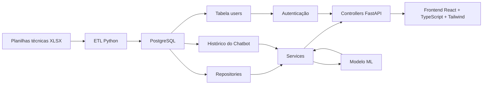
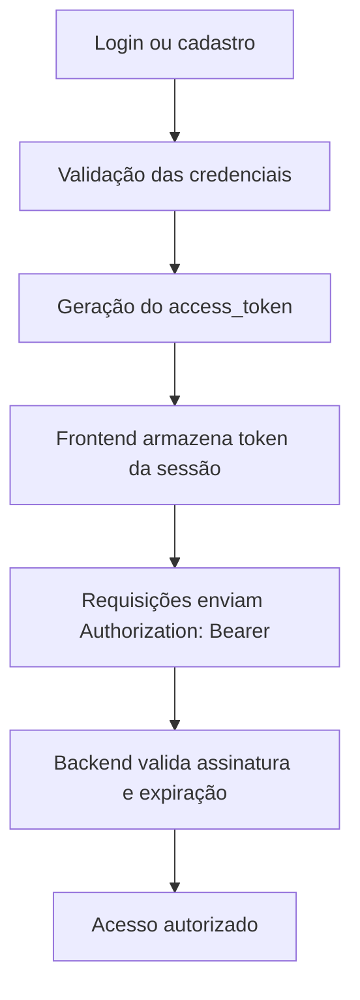
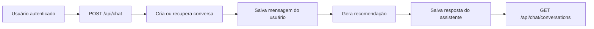
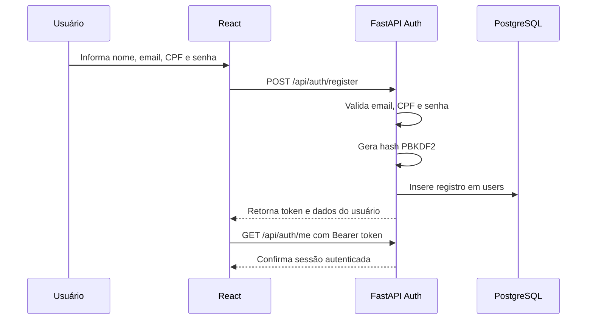
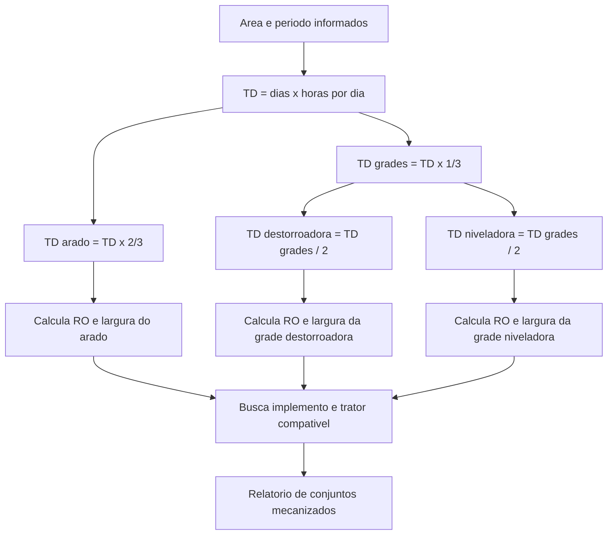
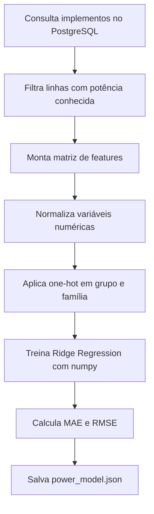

# Arquitetura do Projeto e Treinamento do Modelo de Machine Learning

## Visão Geral

O projeto implementa uma aplicação fullstack para recomendação técnica de regulagem de implementos agrícolas de preparo do solo. A solução integra dados extraídos de catálogos e anuários, armazenamento estruturado em PostgreSQL, uma API FastAPI, uma interface React e um modelo de machine learning para apoiar recomendações de potência e compatibilidade.

## Arquitetura em Camadas



## Organização do Backend

Cada domínio principal segue o padrão:

```text
controller.py   -> rotas HTTP FastAPI
service.py      -> regras de negócio e orquestração
schemas.py      -> contratos Pydantic de entrada e saída
repository.py   -> acesso ao banco de dados
models.py       -> modelos SQLAlchemy quando há persistência
```

Domínios implementados:

- `implements`: arados, grades, subsoladores e escarificadores.
- `tractors`: tratores extraídos do anuário.
- `recommendations`: geração e histórico das recomendações.
- `chat`: interpretação textual simples, encaminhamento para recomendação e histórico de conversas por usuário.
- `ml`: treinamento, persistência e inferência do modelo.
- `auth`: cadastro, login, usuário autenticado, hash de senha e emissão de token.
- `operation_planning`: dimensionamento operacional de arado, grade destorroadora e grade niveladora.

## Autenticação e Segurança

O sistema possui autenticação própria para usuários da aplicação. O cadastro coleta nome, e-mail, CPF e senha. A tabela `users` é criada por migration Alembic e contém índices únicos para `email` e `cpf`, evitando duplicidade de cadastro.

As senhas não são armazenadas em texto puro. O backend usa hash PBKDF2 com salt individual por usuário. Após login, a API retorna um token assinado por HMAC, usado pelo frontend para manter a sessão no navegador.

O controle de acesso usa dois papéis:

- `admin`: acesso completo, incluindo painel, banco técnico, tratores, modelo de ML e dados administrativos.
- `user`: acesso apenas às áreas operacionais de recomendação, planejamento e chatbot.

Essa distinção protege o banco técnico contra acesso direto por usuários comuns.

## Tokenização dos Acessos

A tokenização dos acessos transforma uma autenticação bem-sucedida em uma credencial temporária de uso: o `access_token`. Esse token não contém a senha do usuário. Ele carrega apenas informações mínimas, como o identificador do usuário (`sub`) e o tempo de expiração (`exp`), além de uma assinatura criptográfica HMAC que permite ao backend identificar qualquer alteração indevida no conteúdo.

No projeto, a tokenização cumpre quatro papéis:

- manter o usuário autenticado entre telas da plataforma;
- evitar reenvio constante de e-mail e senha;
- permitir validação rápida pelo backend;
- preparar o sistema para proteger rotas futuras, como histórico de recomendações por usuário.

Fluxo técnico do token:



Formato de envio em chamadas HTTP:

```text
Authorization: Bearer <access_token>
```

Na implementação atual, a rota `GET /api/auth/me` já utiliza esse mecanismo para validar a sessão do usuário autenticado. O mesmo token protege as rotas de recomendação, planejamento, chatbot e as rotas administrativas.

## Histórico de Conversas

O chatbot registra histórico por usuário autenticado. Cada pergunta cria ou continua uma conversa, salvando a mensagem do usuário e a resposta do assistente.

Tabelas usadas:

- `chat_conversations`: conversa, usuário dono, título e datas.
- `chat_messages`: mensagens da conversa, papel (`user` ou `assistant`), conteúdo e metadados técnicos da recomendação.





## Migrations do Banco

A evolução estrutural do banco é versionada com Alembic. A primeira migration adicionada ao projeto é:

```text
20260507_0001_create_users_table.py
```

Ela cria a tabela `users` com:

- `id`;
- `name`;
- `email`;
- `cpf`;
- `password_hash`;
- `is_active`;
- `created_at`;
- `updated_at`.

A migration seguinte adiciona controle de acesso e histórico do chatbot:

```text
20260608_0002_roles_and_chat_history.py
```

Ela adiciona:

- coluna `role` em `users`;
- tabela `chat_conversations`;
- tabela `chat_messages`.

Comando para aplicar migrations:

```bash
cd app/backend
alembic upgrade head
```

## Fluxo de Dados

1. As planilhas `anuario.xlsx`, `extracao_arados.xlsx` e `extracao_grades.xlsx` são lidas pelo script `load_data.py`.
2. O ETL normaliza faixas textuais como `120 a 150 hp`, pesos por diâmetro de disco e larguras de trabalho.
3. Os dados normalizados são salvos no PostgreSQL nas tabelas `implements` e `tractors`.
4. O serviço de recomendação consulta os implementos candidatos e calcula score técnico.
5. O modelo de ML estima a potência esperada para cada configuração.
6. A API retorna recomendações ranqueadas para o frontend e para o chatbot.

## Dimensionamento Operacional

O modulo `operation_planning` aplica as observacoes de planejamento mecanizado. O usuario informa area em hectares e periodo de trabalho. A API calcula o tempo disponivel, divide o tempo entre aracao e gradagem, calcula ritmo operacional, largura minima de trabalho e numero de conjuntos.



Formulas usadas:

```text
TD = (data final - data inicial) x horas por dia
TD arado = TD x 2/3
TD grades = TD x 1/3
TD grade destorroadora = TD grades / 2
TD grade niveladora = TD grades / 2
RO arado = area / TD arado
RO grades = area x 2 / TD da operacao
L = RO x 10 / (velocidade x eficiencia de campo)
N equipamentos = teto(RO x 10 / (largura selecionada x velocidade x eficiencia))
```

O sistema usa `5,5 km/h` e eficiencia `0,85` para arado, `7,0 km/h` e eficiencia `0,90` para grade destorroadora, e `10,0 km/h` com eficiencia `0,90` para grade niveladora.

## Treinamento do Modelo de Machine Learning

O modelo inicial usa regressão Ridge implementada com `numpy`. Essa escolha é adequada para a etapa de validação progressiva porque:

- é simples de explicar ao professor e aos avaliadores;
- funciona com poucas centenas de amostras;
- permite rastrear quais variáveis entram no cálculo;
- gera um artefato leve em JSON;
- pode ser substituído futuramente por Random Forest, Gradient Boosting ou modelos híbridos.

## Variável Alvo

```text
potencia_media_hp
```

A potência média é calculada a partir das faixas técnicas extraídas das tabelas dos fabricantes. Exemplo:

```text
120 a 150 hp -> potencia_media_hp = 135
```

## Variáveis de Entrada

Variáveis numéricas:

- largura de trabalho em mm;
- profundidade média de trabalho;
- espaçamento entre discos/hastes;
- peso médio do implemento;
- número de discos;
- número de hastes.

Variáveis categóricas:

- grupo do implemento (`ARADO`, `GRADE`);
- família técnica (`AF`, `ARH`, `NVCR`, `CRI`, etc.).

As variáveis categóricas são codificadas por one-hot encoding.

## Processo de Treinamento



## Uso do Modelo na Recomendação

Durante uma recomendação:

1. O usuário informa potência do trator, tipo de implemento, solo e umidade.
2. O sistema seleciona candidatos no PostgreSQL.
3. O modelo estima a potência esperada do candidato.
4. O serviço de recomendação combina:
   - compatibilidade com a potência do trator;
   - tipo de implemento solicitado;
   - família/modelo desejado;
   - textura do solo;
   - condição de umidade;
   - profundidade de trabalho.
5. O resultado final é um ranking com score de 0 a 100.

## Validação Progressiva na Pesquisa

Este desenho permite concluir o projeto em etapas:

1. **Validação técnica de base**: conferir se os dados extraídos refletem os manuais.
2. **Validação computacional**: verificar se API, banco, frontend e modelo retornam respostas coerentes.
3. **Validação com especialistas**: comparar recomendações do sistema com respostas de agrônomos ou operadores experientes.
4. **Validação em campo**: medir tempo de regulagem, compatibilidade com potência do trator e qualidade operacional antes/depois do uso do chatbot.
5. **Evolução com IoT**: inserir umidade do solo e outras leituras como variáveis reais de entrada.

## Limitações Atuais

- O modelo aprende a partir de dados técnicos de catálogo, não de medições reais de campo.
- As variáveis de solo, umidade e cultura ainda entram como heurísticas no score, não como dados supervisionados.
- A validação agronômica depende de entrevistas e testes em propriedades parceiras.

## Próximos Passos Científicos

- Construir um protocolo de entrevista com agrônomos.
- Registrar recomendações emitidas pelo sistema e avaliações humanas.
- Coletar amostras reais de solo, umidade e desempenho operacional.
- Comparar o modelo linear atual com Random Forest após obter dados de campo.
- Medir indicadores: tempo de regulagem, erro de seleção de implemento, consumo operacional e qualidade visual do preparo.
